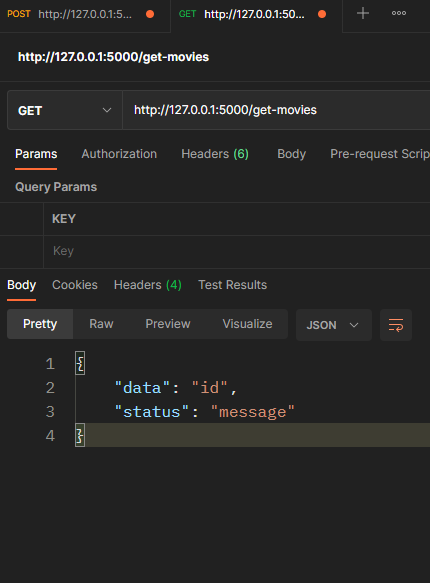

# c141

##  this is what i could working till . the csv file is compressed in .rar format so extract it  and the flaskmockup1(actc).py containes code as per the curiculam which is not working at all 

## and the project also not wroking 
